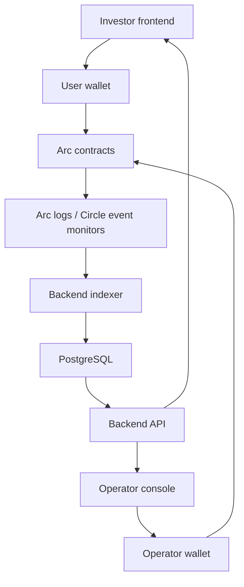

# Arc Capital V2 Architecture

Arc Capital V2 is a USDC-native RWA investment platform built for Arc. The goal is to keep contract logic precise, move source-of-truth financial aggregation to the backend, and make the frontend a clean signing and display layer.

## Principles

- Arc is the default chain for V2.
- USDC is the settlement asset for every user and treasury flow.
- ERC-20 USDC amounts use 6 decimals. Native Arc gas uses 18 decimals.
- Contracts enforce ownership, settlement, vault rules, and yield claims.
- PostgreSQL stores indexed activity, portfolio summaries, treasury history, deal metadata, and admin audit records.
- Frontend code should not calculate trusted financial state beyond display-only formatting and previews.
- No fake financial metrics should appear in production UI.

## System Shape



## V2 Modules

### Monthly Vault

The Monthly Vault handles flexible RWA exposure with monthly liquidity windows.

Contract responsibilities:

- Accept USDC deposits.
- Mint and burn vault shares.
- Settle withdrawals directly to wallets.
- Apply withdrawal penalties outside configured windows.
- Accept treasury yield injections.
- Emit complete lifecycle events.

Backend responsibilities:

- Track investor capital, routed yield, NAV, share balances, and withdrawal history.
- Calculate yearly APY from indexed yield history.
- Provide dashboard, portfolio, and admin summaries.

### Long-Term Fixed Income

The Long-Term Vault handles deterministic lockups.

Contract responsibilities:

- Create fixed-income positions.
- Store principal, APY, maturity, and claim checkpoints.
- Calculate claimable yield deterministically.
- Support claim, maturity redemption, and optional early exit.

Backend responsibilities:

- Build maturity calendars.
- Track treasury obligations.
- Summarize active positions and yield liabilities.

### Deal Vaults

Deal Vaults isolate private investment opportunities.

Contract responsibilities:

- Accept USDC while a deal is open.
- Reject investments after close or expiry.
- Track ownership shares.
- Distribute revenue pro rata.
- Preserve historical ownership and distribution state.

Backend responsibilities:

- Store deal metadata, documents, risk level, deadlines, target raise, and admin updates.
- Classify open and closed deals.
- Index investor activity and deal revenue history.

### Marketplace

The marketplace enables secondary trading of eligible deal ownership.

Contract responsibilities:

- Escrow listed ownership shares.
- Create, cancel, and fill listings.
- Settle USDC and ownership atomically.

Backend responsibilities:

- Index active listings, user orders, fills, volume, and historical trade records.

## Backend Source Of Truth

V2 APIs should read from PostgreSQL summaries instead of scanning large block ranges at request time.

Backend-owned calculations:

- portfolio value
- deal status
- vault summaries
- marketplace summaries
- treasury and yield history
- admin metrics
- transaction history
- validation rules

## Event Ingestion

V2 indexes contract activity through a normalized event ingestion layer.

Endpoint:

- `POST /api/v2/indexer/events`

The endpoint accepts batches of already-normalized events, deduplicates them by `chainId + txHash + logIndex`, stores the raw event in `v2_contract_events`, and projects known event types into summary tables.

Production deployments should set `INDEXER_WEBHOOK_SECRET` and send it as the `x-indexer-secret` request header.

Initial normalized event shape:

```json
{
  "events": [
    {
      "chainId": 5042002,
      "contractAddress": "0x...",
      "eventName": "Deposit",
      "txHash": "0x...",
      "logIndex": 0,
      "blockNumber": "12345",
      "blockTimestamp": "2026-05-20T00:00:00.000Z",
      "actorWallet": "0x...",
      "payload": {
        "user": "0x...",
        "amount": "100.000000",
        "shares": "10.000000"
      }
    }
  ]
}
```

Circle event monitors or an Arc RPC polling worker can both feed this normalized endpoint. User-facing API routes should consume the indexed tables, not scan chain history directly.

Frontend-owned logic:

- wallet connection
- transaction signing
- form state
- loading state
- modals
- tab display
- sorting/filtering for presentation
- number/date/address formatting

## Circle And Arc Integration

Arc Testnet configuration:

- Chain ID: `5042002`
- RPC: `https://rpc.testnet.arc.network`
- Explorer: `https://testnet.arcscan.app`
- ERC-20 USDC: `0x3600000000000000000000000000000000000000`

Circle integration targets:

- Smart Contract Platform for importing, deploying, and monitoring contracts.
- Circle event monitors for production indexing.
- Circle pre-audited contract templates where standard ERC-1155 ownership tokens are sufficient.
- Circle Wallets for future embedded onboarding.
- CCTP or Gateway for future crosschain USDC funding.

## Security Boundary

- Never expose private keys, Circle API keys, entity secrets, or database URLs in frontend code.
- Admin authorization must be checked server-side.
- Treasury actions must be logged and confirmed.
- Contract writes must wait for confirmation before reporting success.
- All onchain monetary amounts must use integer-safe math.
- USDC must always be parsed and formatted with 6 decimals.
